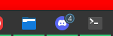

# Estoy's Custom Docklike Taskbar for Xfce
This is a modification of the Dock Taskbar plugin. You can find the original here: https://gitlab.xfce.org/panel-plugins/xfce4-docklike-plugin.

I am developing this project based on my own needs and those of some of my friends, which is why several files are currently missing, such as the localization/translation files.

## New features
### Notifications badge
Displays a badge heavily inspired by KDE through the `com.canonical.Unity.LauncherEntry` protocol. Some programs may require `libunity` to be installed on your system in order to work properly.



## Install
### Auto
As soon as I implement any new features for this dock, I will work on integrating it into my [custom pacman repository](https://github.com/EstoyAburridowGH/pacman-repository).
### Manual
#### Installation
Clone/download this repository and run:
```bash
meson setup build 
meson compile -C build 
sudo meson install -C build
```
#### Uninstallation
```bash
sudo ninja uninstall -C build
```
